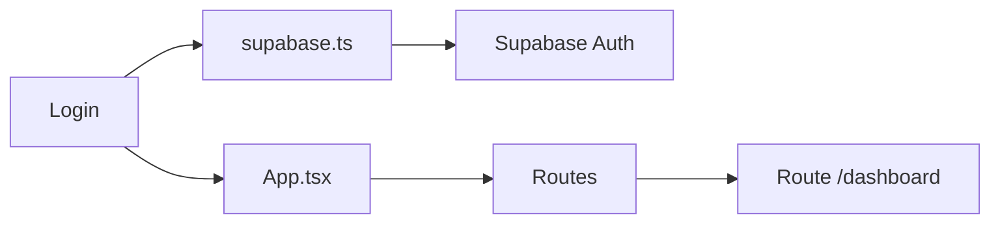

# Login

## Resumen

Página de autenticación de Javi Control. Permite al usuario iniciar sesión para acceder al dashboard.

**Archivo:** `src/pages/Login.tsx`
**Líneas:** 158
**Ruta:** `/`

## Propósito

- Autenticar usuario contra Supabase Auth
- Permitir acceso al dashboard si las credenciales son válidas
- Mostrar errores si la autenticación falla
- Modo demo para desarrollo sin backend configurado

## Tecnologías Usadas

| Tecnología | Propósito |
|------------|-----------|
| React 19 | Framework UI |
| TypeScript | Tipado |
| useState | Estados locales (email, password, loading, error) |
| useEffect | Custom hook useMediaQuery |
| useNavigate | Navegación programática |
| supabase.auth.signInWithPassword | Autenticación |
| Estilos inline | Estilado |

## Bloques de Lógica

### 1. Custom Hook: useMediaQuery

```tsx
function useMediaQuery(query: string) {
  const [matches, setMatches] = useState(false)
  
  useEffect(() => {
    const media = window.matchMedia(query)
    if (media.matches !== matches) {
      setMatches(media.matches)
    }
    const listener = () => setMatches(media.matches)
    media.addEventListener('change', listener)
    return () => media.removeEventListener('change', listener)
  }, [matches, query])
  
  return matches
}
```

**Propósito:** Detectar si la pantalla es mobile (ancho < 767px)

**Puntos clave:**
- Usa `window.matchMedia()` para consultar el tamaño de pantalla
- Agrega event listener para detectar cambios de tamaño
- **Cleanup:** `removeEventListener` para evitar memory leaks
- Retorna `true` o `false` según el breakpoint

**Uso:**
```tsx
const isMobile = useMediaQuery('(max-width: 767px)')
```

---

### 2. Estados

```tsx
const [email, setEmail] = useState('')
const [password, setPassword] = useState('')
const [loading, setLoading] = useState(false)
const [error, setError] = useState('')
const navigate = useNavigate()
```

| Estado | Tipo inicial | Propósito |
|--------|-------------|-----------|
| `email` | `''` | Guardar email del input |
| `password` | `''` | Guardar contraseña del input |
| `loading` | `false` | Indicar si está procesando |
| `error` | `''` | Mensaje de error a mostrar |
| `navigate` | - | Función para navegar |

---

### 3. Handler: handleLogin

```tsx
const handleLogin = async (e: React.FormEvent) => {
  e.preventDefault()
  setLoading(true)
  setError('')

  try {
    // Modo demo - siempre permite acceso
    if (isDemoMode || !supabase) {
      await new Promise(resolve => setTimeout(resolve, 500))
      navigate('/dashboard')
      return
    }

    // Modo real - usar Supabase
    const { error } = await supabase.auth.signInWithPassword({
      email,
      password
    })

    if (error) throw error
    navigate('/dashboard')
  } catch (err: unknown) {
    const errorMessage = err instanceof Error ? err.message : 'Error al iniciar sesión'
    setError(errorMessage)
  } finally {
    setLoading(false)
  }
}
```

**Flujo:**
1. `e.preventDefault()` - Evita recarga de página
2. `setLoading(true)` - Activa estado de carga
3. `setError('')` - Limpia errores previos
4. **Si modo demo:** Simula delay 500ms → navega a dashboard
5. **Si modo real:** Llama a Supabase auth
6. **Si error:** Lo captura y muestra en UI
7. **Si éxito:** Navega a dashboard
8. **Finally:** Siempre desactiva loading

---

### 4. Render

El return contiene:

**Contenedor principal**
```tsx
<div style={{
  minHeight: '100vh',
  display: 'flex',
  justifyContent: 'center',
  alignItems: 'center',
  backgroundImage: `linear-gradient(..., url(/logojavi.PNG))`
}}>
```

**Tarjeta del login**
- Ancho: 480px (desktop), 100% (mobile)
- Padding: 32px (desktop), 24px (mobile)
- Sombre: conditional según device
- Border radius: conditional

**Logo**
```tsx

<h1>Javi Control</h1>
<p>Gestión de Máquinas</p>
```

**Banner demo**
```tsx
{isDemoMode && (
  <div style={{...}}>
    Modo Demo - Click 「Iniciar Sesión」 para ver la app
  </div>
)}
```

**Formulario**
```tsx
<form onSubmit={handleLogin}>
  <input
    type="email"
    value={email}
    onChange={(e) => setEmail(e.target.value)}
    disabled={isDemoMode}
  />
  <input
    type="password"
    value={password}
    onChange={(e) => setPassword(e.target.value)}
    disabled={isDemoMode}
  />
  {error && <div style={{backgroundColor: '#fee2e2'}}>{error}</div>}
  <button type="submit" disabled={loading}>
    {loading ? 'Iniciando...' : 'Iniciar Sesión'}
  </button>
</form>
```

---

## Estilos

Todos los estilos son inline. El diseño es responsive con breakpoints en 767px.

**Colores:**
- Primary: `#532D8C` (violeta)
- Primary light: `#7B5CC9`
- White: `#ffffff`
- Error: `#dc2626`
- Background error: `#fee2e2`

**Tipografía:**
- Título: 24px (desktop), 20px (mobile), bold
- Labels: 14px, font-weight 500
- Inputs: 16px (desktop), 14px (mobile)
- Botón: 16px (desktop), 14px (mobile), font-weight 600

---

## edge Cases

1. **Input disabled en modo demo:** El usuario no puede editar, pero el botón funciona
2. **Error en autenticación:** Se muestra en un div con fondo rojo
3. **Loading state:** El botón se deshabilita y muestra "Iniciando..."
4. **Credenciales vacías:** El navegador valida por defecto (required en inputs)

---

## Conexiones



---

## Siguiente: [[2b-Dashboard]]

---
*Parte del Cerebro: Javi Control | 1.1 Estructura → 1.1.1 Pages → Login*